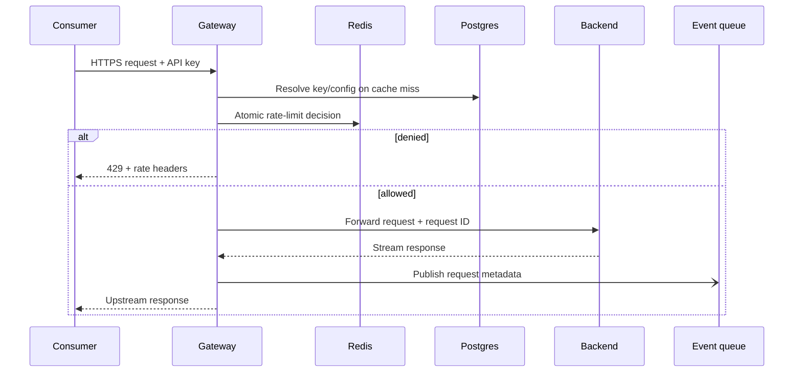

# API Management Platform — Systems Design

**Status:** Proposed architecture  
**Audience:** Project maintainers, backend engineers, platform engineers, and security reviewers  
**Primary objective:** Provide a secure, observable, and horizontally scalable control plane and data plane for proxying client APIs.

## 1. Executive architecture decision

The platform should be implemented as a **separated control plane and data plane**, even if both are initially deployed from one repository and one application image.

The **control plane** manages tenants, client applications, API keys, backend routes, policies, and analytics queries. The **data plane** handles proxied traffic and must remain fast and available when analytics queries or administrative operations are slow. PostgreSQL remains the source of truth for configuration and durable records. Redis remains the shared, low-latency policy-enforcement store. A durable event path should replace direct fire-and-forget database writes as traffic grows.

The recommended evolution is:

| Stage | Deployment shape | Suitable scale | Main objective |
|---|---|---:|---|
| MVP | One Node.js service with separated modules, PostgreSQL, Redis | Low traffic and development | Validate gateway behavior and product model |
| Production baseline | Horizontally scaled gateway instances, managed PostgreSQL, highly available Redis, background log worker | Moderate traffic | Remove single-process assumptions and protect the request path |
| Growth | Dedicated control-plane API, stateless gateway fleet, queue or stream, log warehouse, dashboard | High traffic or many tenants | Isolate workloads and scale each plane independently |

The platform must not treat the backend URL supplied by a client as an arbitrary runtime destination. Backend registration is a privileged control-plane operation and must enforce HTTPS, DNS/IP restrictions, private-network protections, and outbound network policy. This directly addresses server-side request forgery risk and unsafe consumption of upstream APIs identified by OWASP.[1]

## 2. Scope and non-goals

The first release provides tenant-aware API proxying, API-key authentication, configurable rate limiting, upstream routing, request metadata logging, administrative key management, and analytics. It does not attempt to be a complete API lifecycle suite with schema transformation, billing, developer self-service onboarding, or a full policy language.

The following capabilities are intentionally deferred but designed for compatibility: OAuth 2.0 and JWT validation, per-route policies, quotas, request/response transformation, API version management, custom domains, webhooks, monetization, and a developer portal.

## 3. System context

```mermaid
flowchart LR
    Consumer[API consumer] -->|HTTPS + X-API-Key| Edge[Load balancer / WAF]
    Edge --> Gateway[Stateless API gateway fleet]
    Gateway --> Redis[(Redis policy store)]
    Gateway --> Config[(PostgreSQL configuration]
    Gateway --> Events[(Durable event queue)]
    Gateway --> Upstream[Registered client backend]
    Events --> Worker[Analytics worker]
    Worker --> Logs[(PostgreSQL request logs)]
    Worker --> Warehouse[(Optional analytics warehouse)]
    Admin[Admin UI / CLI] --> Control[Control-plane API]
    Control --> Config
    Control --> Redis
```

The load balancer or web application firewall terminates public TLS, applies coarse network protections, and forwards traffic to gateway instances. Gateway instances are stateless and may be added or removed without moving tenant state. PostgreSQL stores durable configuration. Redis stores ephemeral counters and optionally a short-lived configuration cache. The event queue decouples request completion from analytics persistence.

### Visual architecture

*(Diagram source: see [`api-management-system-design.mmd`](api-management-system-design.mmd) — render it at [mermaid.live](https://mermaid.live) or view it directly on GitHub, which renders `.mmd`-embedded mermaid blocks automatically.)*

The editable source for this diagram is available in [`api-management-system-design.mmd`](api-management-system-design.mmd).

## 4. Core domain model

The current `Client`, `ApiKey`, and `RequestLog` entities are a useful start, but the production model needs explicit tenancy, route configuration, key lifecycle, and policy versioning.

| Entity | Purpose | Important fields and constraints |
|---|---|---|
| `Tenant` | Security and billing boundary | `id`, `name`, `status`, timestamps; every control-plane row carries `tenant_id` |
| `Application` | A consumer application owned by a tenant | `id`, `tenant_id`, `name`, environment, status |
| `ApiKey` | Credential used by a consumer | Store only a keyed hash; retain a short prefix for identification; `status`, `created_at`, `expires_at`, `last_used_at`, optional `revoked_at` |
| `Backend` | Registered upstream service | `id`, `tenant_id`, normalized HTTPS URL, health status, outbound policy metadata |
| `Route` | Public-to-upstream mapping | public prefix, upstream path prefix, methods, backend ID, active policy version |
| `Policy` | Versioned gateway behavior | rate limit, burst, timeout, body limit, allowed methods, retry policy, auth mode |
| `RequestEvent` | Immutable operational event | request ID, tenant, key, route, method, status, duration, bytes, timestamp, error class |
| `AuditEvent` | Administrative security trail | actor, action, target, before/after metadata, IP, timestamp |

A single client should not be required to have only one backend URL. Use `Backend` and `Route` now, even if the initial UI exposes one default route. This prevents a future breaking migration when one tenant needs multiple API versions or services.

### Key storage and lookup

API keys must never be stored in plaintext. Generate at least 32 cryptographically secure random bytes, encode them for transport, display the secret once, and store a keyed digest such as HMAC-SHA-256 with a server-side pepper. The lookup path should use a non-secret key prefix to locate candidate records and then perform constant-time digest comparison. A database compromise must not immediately become an active gateway credential compromise.

## 5. Request lifecycle

Every proxied request receives a correlation ID at the edge or gateway. The gateway should execute the following ordered stages:

1. **Transport validation.** Enforce HTTPS at the edge, reject unsupported HTTP methods, apply maximum header and body sizes, and attach a trusted request ID. Never trust a client-supplied forwarding header unless it was overwritten by a trusted proxy.
2. **Credential extraction.** Read the API key from `X-API-Key` or a documented alternative. Reject ambiguous requests containing multiple credential sources. Do not log the credential or its full value.
3. **Credential verification.** Resolve the key from a local bounded cache or PostgreSQL, verify status and expiration, and load the immutable policy snapshot. Return `401` for missing or invalid credentials and `403` for valid but revoked, disabled, or unauthorized credentials.
4. **Route resolution.** Match the request to a tenant-owned route. The route must resolve to a backend registered in the control plane. Do not derive an upstream host directly from user input.
5. **Distributed rate limiting.** Execute an atomic Redis policy check using a key such as `rl:{policy_version}:{tenant_id}:{api_key_id}:{route_id}`. Return `429` with `Retry-After`, `X-RateLimit-Limit`, `X-RateLimit-Remaining`, and `X-RateLimit-Reset` when denied.
6. **Request guardrails.** Enforce timeout, maximum body size, allowed methods, and optional content-type rules before opening the upstream connection.
7. **Upstream proxying.** Forward only an allowlisted header set, attach the correlation ID, strip gateway-only headers, and stream the response. Apply bounded retries only to idempotent requests and only for connection failures or selected `5xx` responses.
8. **Response finalization.** Record status and duration, sanitize response headers, and return the upstream response. The request path must not wait for analytics persistence.
9. **Event publication.** Publish a compact event containing metadata rather than bodies or secrets. If the event system is unavailable, use a bounded local buffer or sampling fallback and expose a metric; never allow unbounded memory growth.



## 6. Rate limiting design

Redis is appropriate because rate-limit state is high-frequency, shared across gateway instances, and short-lived. Redis documentation explicitly supports centralized per-user, per-API, and per-tenant enforcement and recommends atomic operations or Lua scripts for concurrent decisions.[2]

The MVP may use a fixed-window counter, but the production default should be a **token bucket**. A token bucket supports a sustained rate and a bounded burst, which is more useful than a hard edge at each minute boundary. The bucket state contains `tokens` and `last_refill_ms`. A Lua script should calculate refill, reject or decrement atomically, and set a TTL based on the idle lifetime of the policy.

The policy hierarchy should be evaluated from most specific to least specific:

| Level | Example key | Use |
|---|---|---|
| Route + key | `tenant:key:route` | Protect expensive or sensitive endpoints |
| Tenant | `tenant` | Protect the platform and upstream allocation |
| IP or network | `tenant:key:ip` | Mitigate leaked keys and abusive clients |
| Global platform | `global` | Emergency protection and overload shedding |

A Redis outage requires an explicit failure policy. The default for authenticated production traffic should be **fail closed for sensitive routes** and **fail open with a conservative local emergency limit for low-risk routes**, controlled by policy. This choice must be visible in configuration and metrics rather than hidden in exception handling.

## 7. Data persistence and analytics

The gateway should not issue a synchronous PostgreSQL insert for every response. The current response `finish` listener is non-blocking from the caller's perspective, but it still creates an unbounded failure mode under traffic spikes and can overload PostgreSQL through connection churn.

Use this progression:

| Phase | Logging mechanism | Durability |
|---|---|---|
| MVP | In-process async insert with a bounded queue | Best effort |
| Production baseline | Redis Streams, NATS, RabbitMQ, or cloud queue + worker | At-least-once |
| Growth | Stream retained in object storage or warehouse ingestion | Durable analytics history |

Events should include request ID, tenant ID, API key ID, route ID, method, normalized path template, response status, latency, upstream latency, response bytes, rate-limit outcome, and error category. Do not store authorization headers, API keys, cookies, request bodies, response bodies, or sensitive query parameters by default. If payload capture is ever introduced, it requires explicit tenant policy, encryption, redaction, retention, and access controls.

Partition `RequestEvent` by event time only after measured data volume justifies it. PostgreSQL states that partitioning helps when tables become large, improves pruning for time-bounded queries, and makes bulk retention deletion faster, but poor partition choices and excessive partition counts add planning and memory overhead.[3] A practical design is monthly partitions for normal volumes, with an automated job creating future partitions and detaching expired partitions according to retention policy.

Analytics queries must run against read replicas, pre-aggregated rollups, or a warehouse once they begin competing with control-plane queries. The dashboard should query rollups such as `hourly_route_metrics` rather than scanning raw request events for every chart.

## 8. Control plane and data plane boundaries

The control plane owns authenticated administrative operations such as creating a backend, issuing a key, changing a rate limit, revoking a key, and reading analytics. These operations require tenant isolation and role-based authorization. The data plane consumes a versioned configuration snapshot and should not perform arbitrary joins or complex policy computation on every request.

Configuration updates should use an immutable version model:

1. The control plane writes the new configuration in a transaction.
2. It validates the backend URL, policy, and route collision rules.
3. It increments a tenant or route configuration version.
4. It publishes an invalidation message.
5. Gateways evict or refresh the affected cache entry.
6. The control plane records an audit event.

A gateway may cache active key and route policy for a short period, such as 30–60 seconds, but revocation requires a fast invalidation path. For high-security routes, the gateway should check a Redis revocation set on every request or use a shorter cache TTL. Configuration reads must be bounded and must not allow PostgreSQL failure to create an uncontrolled storm.

## 9. Security architecture

Security is a system property, not only an authentication middleware concern.

| Area | Required control |
|---|---|
| Authentication | Hashed keys, constant-time verification, expiration, revocation, rotation, secret shown once |
| Authorization | Tenant isolation, role-based control-plane authorization, route-level policy checks |
| SSRF defense | HTTPS-only backends, DNS resolution validation, block loopback/link-local/private ranges unless explicitly approved, egress firewall, redirect revalidation |
| Transport | TLS at the edge and encrypted service-to-service traffic where applicable |
| Input limits | Header, URL, body, timeout, connection, and response-size limits |
| Header safety | Allowlist forwarded headers; strip `X-API-Key`, cookies, internal routing headers, and spoofable forwarding headers |
| Abuse controls | Per-key, per-route, per-tenant, IP, and global limits; circuit breakers and concurrency caps |
| Auditability | Immutable admin audit events for key, backend, route, and policy changes |
| Secrets | Environment or secret manager injection; never commit credentials; rotate database, Redis, and signing secrets |
| Dependency safety | Lockfiles, automated vulnerability scanning, pinned base images, and regular patching |
| Privacy | Data minimization, configurable retention, redaction, access-controlled analytics |

The gateway must distinguish an upstream response from a gateway-generated response. It should avoid copying upstream `Server`, `Via`, or internal diagnostic headers unless explicitly allowed. Error responses should expose a stable error code and request ID, not stack traces, database errors, internal hostnames, or raw upstream failure details.

## 10. Reliability and failure behavior

The system should degrade predictably. The following matrix defines the minimum behavior:

| Failure | Gateway behavior | Operator signal |
|---|---|---|
| PostgreSQL unavailable | Serve only valid cached configuration; reject unknown credentials; do not create new config | Database health, cache-hit, and config-staleness alerts |
| Redis unavailable | Apply configured fail-open or fail-closed policy; emergency local limit is bounded | Redis error rate and rate-limit fallback metric |
| Event queue unavailable | Bounded buffer and sampling; continue proxying; drop oldest or lowest-priority events after limit | Event loss count and queue saturation |
| Upstream timeout | Return `504`; stop waiting after route timeout; increment upstream timeout metric | Per-backend timeout and latency alerts |
| Upstream connection failure | Return `502`; use circuit breaker to prevent connection storms | Backend health and open-circuit metric |
| Gateway instance failure | Load balancer routes to healthy instances; no request state is lost | Instance restart and availability alerts |
| Configuration propagation delay | Use last known version within declared TTL; show version in diagnostics | Config age and invalidation lag |

Use idempotency-aware retries only. Retrying `POST`, payment, or mutation requests can duplicate side effects. A retry budget and per-backend circuit breaker are safer than a blanket retry count.

## 11. Capacity model and scaling triggers

Capacity planning should be expressed in measurable variables rather than assumed request counts. Let:

- `R` be peak requests per second;
- `L` be average request-log event size in bytes;
- `D` be retention in seconds;
- `S` be the average number of Redis rate-limit operations per request.

Approximate raw analytics storage before indexes and replication is `R × L × D`. For example, at 500 requests per second, 1,000 bytes per event, and 30 days of retention, raw event data is approximately 1.30 TB before indexes and replicas. This is a signal to use rollups and warehouse/object storage rather than a single unbounded OLTP table.

Track these service-level indicators:

| SLI | Meaning | Initial target |
|---|---|---:|
| Gateway availability | Non-maintenance requests that receive a response | 99.9% monthly |
| Gateway overhead | Gateway latency excluding upstream time | p95 < 20 ms |
| Rate-limit decision latency | Redis policy check time | p99 < 5 ms in-region |
| Configuration freshness | Time from admin commit to gateway visibility | p95 < 10 s |
| Analytics lag | Event time to dashboard availability | p95 < 60 s |
| Upstream success | Requests not failed by gateway or upstream | Tenant-specific |

Scale gateway instances on CPU, active connections, event-loop lag, memory, and p95 overhead. Scale workers on queue depth and event age. Scale PostgreSQL on connection saturation, write IOPS, lock waits, vacuum health, and analytics query latency. Scale Redis on command latency, memory headroom, eviction, replication health, and hot-key concentration.

## 12. API contracts

Use versioned administrative endpoints and a stable error envelope. A representative shape is:

```json
{
  "error": {
    "code": "RATE_LIMIT_EXCEEDED",
    "message": "Request quota exceeded",
    "requestId": "req_01J...",
    "retryAfterSeconds": 12
  }
}
```

Recommended endpoint groups are:

| Group | Example endpoints |
|---|---|
| Health | `GET /health/live`, `GET /health/ready` |
| Control plane | `POST /v1/tenants`, `POST /v1/backends`, `POST /v1/routes`, `GET /v1/policies` |
| Key lifecycle | `POST /v1/applications/{id}/keys`, `POST /v1/keys/{id}/rotate`, `POST /v1/keys/{id}/revoke` |
| Analytics | `GET /v1/analytics/requests`, `GET /v1/analytics/summary` |
| Data plane | `ANY /proxy/{routePrefix}/*` |

Health endpoints must separate liveness from readiness. Liveness answers whether the process should be restarted. Readiness answers whether the instance can accept traffic, including required Redis connectivity and a usable configuration source.

## 13. Repository and module structure

A maintainable Node.js implementation can use the following boundary:

```text
src/
  control-plane/
    tenants/
    applications/
    keys/
    backends/
    routes/
    policies/
  data-plane/
    auth/
    route-resolution/
    rate-limit/
    proxy/
    response-finalization/
  platform/
    config/
    database/
    redis/
    events/
    observability/
    security/
  http/
    errors/
    middleware/
    health/
prisma/
  schema.prisma
  migrations/
workers/
  request-event-consumer.ts
infra/
  docker/
  terraform-or-manifests/
docs/
  runbooks/
  adr/
tests/
  unit/
  integration/
  contract/
  load/
```

Each data-plane middleware should be a small, testable function with explicit inputs and outputs. The proxy adapter should not know how keys are stored. The key repository should not know how HTTP responses are formatted. This separation allows a later migration from Express and `http-proxy-middleware` to a dedicated edge proxy without rewriting domain behavior.

## 14. Testing strategy

The test suite should verify behavior at four levels. Unit tests cover key hashing, policy evaluation, token-bucket math, route matching, header filtering, and error mapping. Integration tests run PostgreSQL and Redis in containers and verify migrations, revocation, rate-limit atomicity, and event publication. Contract tests verify the admin API's OpenAPI schema and the stable error envelope. Load tests measure gateway overhead, upstream streaming, Redis contention, queue backpressure, and behavior when dependencies fail.

Security tests must include SSRF attempts against loopback and cloud metadata addresses, invalid redirect targets, header smuggling cases, oversized bodies, expired keys, revoked keys, cross-tenant identifiers, brute-force key lookup, and analytics access by unauthorized tenants. Every production incident should add a regression test.

## 15. Deployment and operations

The production image should be immutable and run as a non-root user. Configuration should come from environment variables or a secret manager, with schema validation at startup. Database migrations should run as a separate deployment step with backward-compatible expand-and-contract changes. The gateway should use graceful shutdown: stop accepting new connections, allow an upper-bounded drain period, flush only bounded event buffers, and exit.

CI should run formatting, type checks, unit tests, integration tests, dependency scanning, container scanning, migration validation, and a smoke test against a disposable stack. Deployment should use rolling or blue-green replacement, readiness gates, automatic rollback on error-budget burn, and an explicit database migration policy.

Required dashboards include gateway traffic and errors, upstream health, rate-limit decisions, Redis health, PostgreSQL health, queue lag, configuration age, key revocations, and audit activity. Logs must be structured JSON with request ID, tenant ID, route ID, status, duration, and error code. Never log secrets or full authorization material.

## 16. Delivery roadmap

### Milestone 1 — Harden the MVP

Keep the current middleware order, but add hashed keys, key expiration and revocation, request IDs, explicit route records, header filtering, body and timeout limits, SSRF-safe backend registration, structured errors, health endpoints, and tests for cross-tenant access.

### Milestone 2 — Make the gateway horizontally scalable

Run multiple stateless gateway instances behind a load balancer. Move rate-limit decisions to an atomic Redis script. Add bounded configuration caching and revocation invalidation. Replace direct request-log inserts with a durable queue and worker.

### Milestone 3 — Separate workloads

Deploy the control-plane API, data-plane gateway, event worker, and analytics query service as separately scalable processes. Add read replicas or rollups for analytics. Add circuit breakers, concurrency limits, upstream health checks, and operational runbooks.

### Milestone 4 — Product expansion

Add a developer portal, self-service application registration, key rotation workflows, route-level policies, OAuth/JWT support, API versioning, custom domains, usage export, and optional billing integration. Each capability should extend the versioned policy model rather than introduce gateway-specific conditionals.

## 17. Architecture decisions to record

| Decision | Recommendation | Reason |
|---|---|---|
| Source of truth | PostgreSQL | Durable relational configuration and auditability |
| Hot-path counters | Redis | Shared atomic low-latency enforcement across instances |
| Gateway state | Stateless | Horizontal scaling and simple replacement |
| Analytics path | At-least-once event delivery | Decouples client latency from storage and supports retries |
| Default limiter | Token bucket | Sustained rate plus controlled bursts |
| Key persistence | HMAC digest, not plaintext | Limits blast radius of database exposure |
| Backend registration | Control-plane-only, SSRF-validated | Prevents arbitrary outbound request abuse |
| Raw logs | Time-partitioned only at justified scale | Retention and time-range queries without premature complexity |
| Retry policy | Idempotency-aware and budgeted | Prevents duplicate upstream side effects |

## 18. Definition of done for production readiness

The platform is ready for an initial production tenant only when a revoked key is rejected across all gateway instances within the declared propagation target; rate limits remain correct under concurrent load; an upstream outage does not exhaust gateway connections; analytics backpressure does not affect proxy latency; backend registration cannot reach protected network ranges; all control-plane mutations generate audit events; secrets are absent from logs and database rows; deployments support graceful rollback; and dashboards and alerts cover each dependency failure mode.

## References

[1]: https://owasp.org/API-Security/editions/2023/en/0x11-t10/ "OWASP Top 10 API Security Risks – 2023"

[2]: https://redis.io/docs/latest/develop/use-cases/rate-limiter/ "Redis rate limiter"

[3]: https://www.postgresql.org/docs/current/ddl-partitioning.html "PostgreSQL Table Partitioning"
